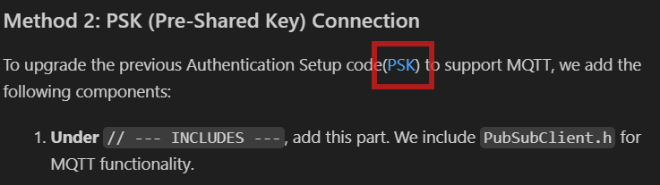
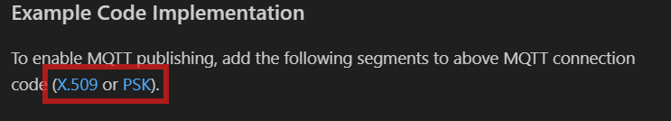

# Suggestion for the documentation UI
Add these parts to the web UI

## `Follow the links`

I have added some links between sections. Check out these links.

---

---
---

---

## `Full code VIEW option.`
Links like `Full X.509 Code >> VIEW`, `Full PSK Code >> VIEW` can behave like below
* It is better to show this full code as a pop-up menu. When the user clicks on the view button, it will show the full code as a pop-up. It can easily be copied and pasted using the copy-to-clipboard button.

---

---

